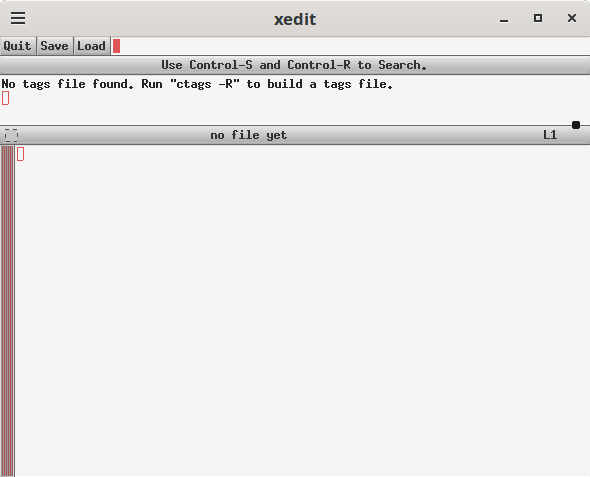

# Linux 桌面与窗口系统

!!! warning "本文初稿编写中"

相比于久负盛名的 Windows 与 macOS，Linux 的桌面以及其生态是独特的。本文将简单介绍 Linux 桌面与窗口系统中一些重要的概念。

## X

### 客户端、服务端与窗口 {#client-server-window}

X 窗口系统起源于 1984 年。在那个时代，桌面环境没有酷炫的效果，相比之下，性能与资源占用重要得多。并且当时个人计算机还是一个新兴的概念，用户更多的时候需要使用终端机连接到服务器上运行任务。因此，X 的设计上包含了当时那个年代设计的局限性，并且有着独特的「网络透明性」的设计：需要显示窗口的程序（客户端）和可以给用户显示窗口的程序（服务端）是可以分离的，通过网络去连接。对于单机场景，这里的「网络」大部分时候是 UNIX socket，而在诸如 SSH X Forwarding 这种通过网络连接的场合则是 TCP socket。

默认情况下，如果你正在使用 Linux 桌面，那么默认连接到的 socket 则为 `/tmp/.X11-unix/X0`（对应环境变量 `DISPLAY=:0`）。

!!! tip "启动一个新的 X Server"

    存在这样一种场景：你需要启动一个独立的 X server 来测试，而不希望对应的程序使用当前的 X server。其中一个便利的工具是 `xvfb-run`：Xvfb 是一个无头（无显示）的 X server，对自动化测试场景来说很方便。安装 `xvfb` 包后，即可使用：

    ```shell
    xvfb-run -f xvfb-auth -n 99 xeyes
    ```

    这里我们设置 `XAUTHORITY` 文件为 `xvfb-auth`，并且 `DISPLAY` 为 `:99`。关于 `XAUTHORITY`，请参考[容器部分的介绍](../ops/virtualization/container.md#docker-gui)。然后可以通过以下命令确认：

    ```console
    $ DISPLAY=:99 XAUTHORITY=./xvfb-auth xlsclients 
    examplehost  xeyes
    ```

    如果希望创建一个 X server 并且能够以子窗口的形式显示出来，那么可以考虑使用 Xephyr 或者 Xwayland 来创建。以 Xephyr 为例，以下命令可以创建一个 800x600 的 X server，并且以窗口的形式显示：

    ```shell
    Xephyr :123 -ac -screen 800x600
    ```

    其他应用可以直接用 `DISPLAY=:123` 环境变量连接到这个 server。

可以运行 `xlsclients` 获取连接到当前 X 服务器的客户端列表：

```console
$ xlsclients
examplehost gsd-xsettings
examplehost steamwebhelper
examplehost code
examplehost mutter-x11-frames
examplehost steam
```

客户端可以创建一个或多个窗口，可以使用 `xwininfo` 获取窗口信息：

```console
$ xwininfo -root -tree

xwininfo: Window id: 0x503 (the root window) (has no name)

  Root window id: 0x503 (the root window) (has no name)
  Parent window id: 0x0 (none)
     57 children:
     0x1a00004 "desktop.md - Linux201-docs - Visual Studio Code": ("code" "Code")  1920x1200+306+1440  +306+1440
        1 child:
        0x2200007 (has no name): ()  1920x1200+0+0  +306+1440
（以下省略）
```

反直觉的是，这里「窗口」的概念可能比你想象的要广得多——在传统的 X11 应用程序中，很多小控件（例如按钮、输入框）也都是窗口。可以尝试打开一个比较复杂的传统 X 程序（例如 `xedit`），然后 `xwininfo` 看一下：



xedit 的界面
{: .caption }

```console
$ xwininfo -name xedit -tree

xwininfo: Window id: 0x4200072 "xedit"

  Root window id: 0x9cf (the root window) (has no name)
  Parent window id: 0x3800096 (has no name)
     1 child:
     0x4200073 (has no name): ()  590x440+0+0  +959+143
        6 children:
        0x4200099 (has no name): ()  8x8+572+436  +1531+579
        0x420007b (has no name): ()  8x8+572+84  +1531+227
        0x420007c (has no name): ()  590x351+0+89  +959+232
           4 children:
           0x420008a (has no name): ()  8x8+586+333  +1545+565
           0x420008c (has no name): ()  1x1+0+0  +959+232
              6 children:
              0x4200096 (has no name): ()  179x21+0+0  +960+233
                 2 children:
                 0x4200098 (has no name): ()  85x17+2+2  +963+236
                 0x4200097 (has no name): ()  64x17+87+2  +1048+236
              0x4200094 (has no name): ()  100x18+0+0  +960+233
                 1 child:
                 0x4200095 (has no name): ()  14x4+-1+-1  +960+233
              0x4200093 (has no name): ()  8x8+0+0  +960+233
              0x4200092 (has no name): ()  64x17+0+0  +960+233
              0x420008e (has no name): ()  1x1+0+0  +960+233
                 2 children:
                 0x4200091 (has no name): ()  14x1+-1+-1  +960+233
                 0x420008f (has no name): ()  1x1+15+0  +976+234
                    1 child:
                    0x4200090 (has no name): ()  1x19+0+0  +976+234
              0x420008d (has no name): ()  8x8+0+0  +960+233
           0x420008b (has no name): ()  8x8+0+0  +959+232
           0x420007d (has no name): ()  590x351+0+0  +959+232
              6 children:
              0x4200083 (has no name): ()  8x8+572+347  +1531+579
              0x4200087 (has no name): ()  179x21+0+0  +959+232
                 2 children:
                 0x4200089 (has no name): ()  85x17+2+2  +962+235
                 0x4200088 (has no name): ()  64x17+87+2  +1047+235
              0x4200085 (has no name): ()  100x18+0+0  +959+232
                 1 child:
                 0x4200086 (has no name): ()  14x4+-1+-1  +959+232
              0x4200084 (has no name): ()  8x8+0+0  +959+232
              0x4200081 (has no name): ()  590x332+0+19  +959+251
                 1 child:
                 0x4200082 (has no name): ()  14x332+-1+-1  +958+250
              0x420007e (has no name): ()  590x18+0+0  +959+232
                 2 children:
                 0x4200080 (has no name): ()  496x15+2+1  +961+233
                 0x420007f (has no name): ()  90x15+498+1  +1457+233
        0x420007a (has no name): ()  590x50+0+38  +959+181
        0x4200079 (has no name): ()  590x18+0+19  +959+162
        0x4200074 (has no name): ()  590x18+0+0  +959+143
           4 children:
           0x4200078 (has no name): ()  479x18+111+0  +1070+143
           0x4200077 (has no name): ()  36x18+74+0  +1033+143
           0x4200076 (has no name): ()  36x18+37+0  +996+143
           0x4200075 (has no name): ()  36x18+0+0  +959+143
```

这和 Windows 的传统桌面 API 的设计是[非常类似](https://learn.microsoft.com/en-us/windows/win32/learnwin32/what-is-a-window-)的。不过创建大量的小窗口需要消耗不少的系统资源，因此目前常见的现代 UI 框架，不管是在 Linux 还是在 Windows 上，都基本上抛弃了这种「万物皆窗口」的理念。

### 窗口管理器 {#window-manager}

另一点有趣的是，尽管 X 中存储了各个窗口的状态（以及它们在 Z 轴的栈式关系），但是 X 本身不会去管理这些窗口要怎么被用户移动、缩放、最大最小化等，也不会去尝试装饰窗口，它只会按照自己记录的状态把这些窗口显示出来。对于具体的窗口管理工作，X 就当起了甩手掌柜，把事情都交给了**窗口管理器**。窗口管理器是一个特殊的 X 客户端，所有我们常用的窗口功能都是由窗口管理器负责的，包括但不限于管理窗口的显示布局、窗口装饰、焦点控制、虚拟桌面等等。X 服务端允许窗口管理器捕获创建窗口的事件，并且允许窗口管理器将对应的窗口 "reparent" 到窗口管理器创建的框架窗口中，以此实现让程序窗口被窗口管理器控制、装饰的效果。

窗口管理器与 X 服务器之间的交互有一些标准规范，例如 ICCCM 与 EWMH，以减小不同的窗口管理器实现之间的混乱与不一致问题。

窗口管理器本身也是一个独立的进程，如果窗口管理器退出，那么其他的 X 客户端不会停止运行，但是你可能无法再控制它们了（例如，可能它们被别的窗口挡住了，而没有窗口管理器的装饰的话，你可能没有办法移动它们）。这种分离的设计也帮助孕育了很多独特的窗口管理器设计，例如平铺式窗口管理器（例如 i3wm），相比于传统的浮动式窗口管理器，可以自动以不重叠的方式显示当前的所有窗口，用户不需要再用鼠标手动调整每个窗口的大小等等。

### X 协议 {#x-protocol}

(TODO)

## Wayland

## DBus
