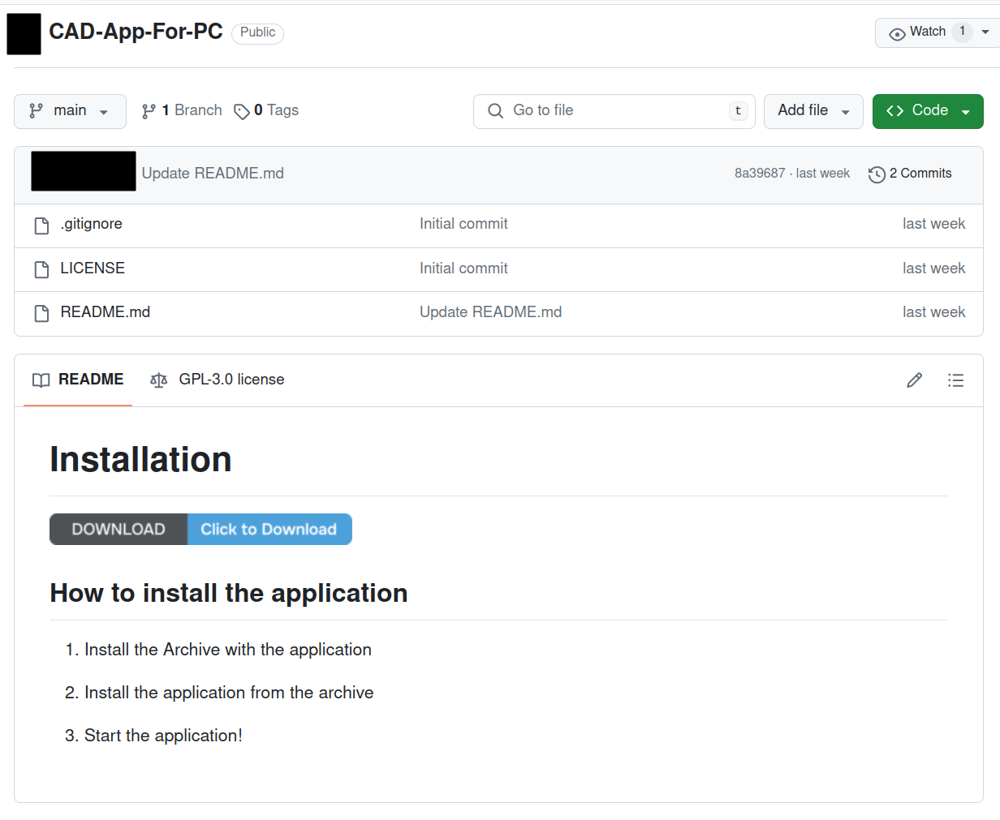
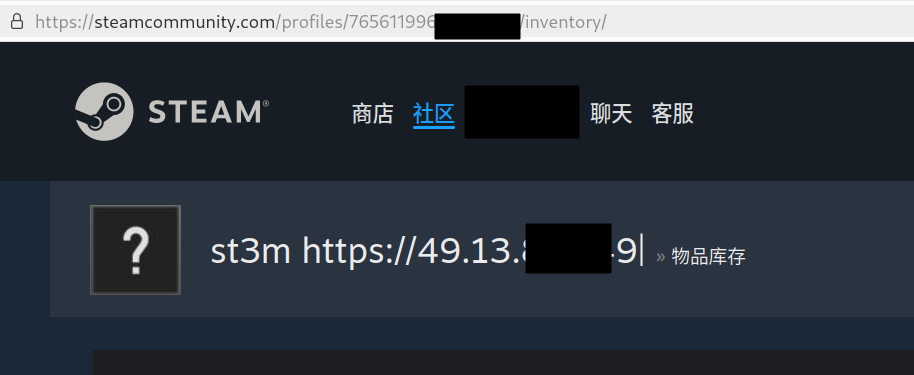

# 安全

!!! warning "本文初稿编写中"

!!! note "阅读注意事项"

    请注意，以下概念介绍部分不是严肃的学术性介绍，存在大幅度的简化，并且不会对抽象的概念进行详细解释。

    以下的介绍一部分参考了[《计算机安全》课程](https://icourse.club/course/6142/)与 [2024 年 3 月小聚活动的内容](https://lug.ustc.edu.cn/news/2024/03/gathering-attack-and-defense-exercise-talk/)。

## 「安全」是什么？ {#what-is-security}

「信息安全」重点关注三个方面：机密性（Confidentiality）、完整性（Integrity）和可用性（Availability），也被称为 CIA 三要素：

- 机密性：确保信息只能被授权的人访问，例如加密数据、对需要访问信息的人员进行身份验证等。
- 完整性：确保信息不被篡改、损坏、丢失，例如数字签名等。
- 可用性：确保信息在需要时可用，例如备份、冗余等。

尽管从这个模型来讲，类似于「因为没有恰当设置 RAID 和备份，导致数据丢失」这样的事件也是安全问题（符合完整性和可用性的定义），但是本部分讨论的「安全」更多关注**蓄意的恶意行为和攻击**，而不是误操作、自然灾害、硬件故障等。虽然可以说两者都是「安全」——前者是 "security"，而后者是 "safety"。

我们希望自己维护的系统是安全的，但是很遗憾的是，这个世界上不可能有绝对安全的系统。我们需要对自己所需的安全模型（威胁模型）有基本的了解，以便判断自己需要做什么，不需要做什么，达到便利与安全的平衡（一些安全加固措施或多或少会影响正常的使用）。

## 事前：预防 {#prevention}

预防安全事件依赖于对威胁的了解（威胁模型分析），一种常见的思路是**从攻击者的视角**考虑问题：如果我是一个攻击者，我会怎么做？

### 网络攻击的基本思路 {#network-attack-ideas}

!!! danger "法律警告"

    进行渗透测试必须得到所有者明确的授权，否则可能触犯法律。

网络攻击的基本思路在渗透测试的流程中有所体现：

- 信息收集：攻击者需要尽可能了解目标系统的各类信息，例如目标服务的 IP 地址、开放的端口、运行的服务等等。这些信息也被称为「信息资产」。
- 边界突破：在获取信息之后，攻击者会尝试突破目标系统的边界，例如通过暴力破解密码、利用漏洞等方式，并且提升自身的权限，为下一步内网渗透做准备。
- 内网渗透：在突破边界之后，攻击者会尝试在内网中移动，攻击内网更多的机器，获取更多的信息，提升权限，最终达成自己的目的。在这个过程中，攻击者可能会尝试将自己使用的攻击方式持久化，以便在利用的漏洞被修复之后仍然能够访问目标系统。攻击者也可能会清理自己的痕迹，避免被系统管理员发现。

### 攻击面 {#attack-surface}

攻击面是系统中可达的、可能被利用的脆弱点。攻击方和防守方都需要对攻击面有所了解，以便有效攻击/防御。

- 软件攻击面：例如暴露在公网的 Web 应用常常是攻击者首选的目标，因为这些应用直接暴露在公网，并且需要处理各种用户输入，更容易受到攻击；此外，其他的服务器软件（例如数据库）可能存在漏洞或者配置不当，也是攻击者的目标。
- 网络攻击面：指在数据传输过程中存在的各种可能被攻击利用的脆弱点，主要涉及网络协议和数据传输。例如，老旧的协议（HTTP、早期的 SSL/TLS 版本等）容易受到中间人攻击；诸如 DNS 劫持、ARP 欺骗等攻击也是常见的网络攻击方式。
- 人为攻击面：人类自己通常是计算机安全中最薄弱的一环。社会工程学攻击（例如钓鱼邮件、电话诈骗等）是攻击者获取信息的常见方式。此外，一些用户也可能会因为自己的疏忽或者不当操作导致系统被攻击。

### 常见漏洞与攻击方法 {#common-vulnerabilities}

#### 弱口令 {#weak-passwords}

由于这个问题实在是太过常见，所以我们在这里单独列出。一般来讲，攻击者有一些常见密码的**字典**，可以在线或者离线地尝试这些密码。最常见的密码包括 "123456"、"password" 等。攻击者也可能从泄漏的密码库中获取指定用户的密码，然后尝试登录，如果用户有多个网站使用相同或相似密码的习惯，那么攻击者就能够轻松登录。攻击者也可以通过指定用户的个人信息（例如姓名、生日、工作单位等）尝试按规律构造密码并尝试。攻击者的密码本中可能存在相对复杂的密码，例如 `1qaz@WSX`（有趣的是，这个密码完美符合有大小写、特殊符号和基础的长度要求，但是是一个很差的密码，可以想一下为什么）等。

此外，一些物理设备或内部网络服务存在固定的默认密码，或者是例如生日、身份证后六位之类有规律的默认密码，并且不要求用户修改。这些密码也很容易被攻击者获取并利用。

!!! danger "内网 ≠ 安全"

    一个常见的误区是，因为系统只有内网能够访问，所以随便设置一个简单的密码就可以了。但是，内网并非固若金汤，当攻击者通过外部服务或者其他方式进入内网之后，这些简单的密码就会成为攻击者的目标。

#### 网络应用 {#web-applications}

网络应用的漏洞是攻击常见的切入点之一。最常见的一类问题是：由于**信任用户输入**，导致恶意构造的数据以非预期的方式被执行。

例如 **SQL 注入**。对于下面的 SQL 查询：

```sql
SELECT * FROM users WHERE username = '$username' AND password = '$password';
```

如果应用程序选择直接通过拼接字符串的方式构造这个查询，并且用户输入的 `username` 是 `admin`，`password` 是 `123' OR '1'='1`，那么查询就会变成：

```sql
SELECT * FROM users WHERE username = 'admin' AND password = '123' OR '1'='1';
```

可以发现，这个查询就不再起到检查密码的作用，恶意用户此时就可以以 `admin` 的身份登录系统。

相似的问题还有 **XSS（跨站脚本攻击）**：如果应用程序直接将用户输入的内容插入到 HTML 中，那么攻击者可以构造恶意的 HTML 代码，例如：

```html
<p>用户评论：{{ comments }}</p>
```

如果应用程序不对用户输入进行过滤，那么攻击者可以构造内容为 `<script>alert('XSS')</script>` 的评论，构造出这样的 HTML 代码：

```html
<p>用户评论：<script>alert('XSS')</script></p>
```

这样所有访问这个页面的用户都会弹出对话框。由于 JavaScript 代码可以访问用户的 Cookie 与 LocalStorage，攻击者可以通过这种方式窃取用户的凭证信息，以用户的身份进行操作（即使不知道用户的密码！）。

此外，还有一些其他的漏洞，例如 **CSRF（跨站请求伪造）**：攻击者可以构造页面，用户在访问这个页面的时候，会向目标网站发送恶意请求（例如转账、修改密码等）。如果目标网站没有对这样的请求有所防御（例如使用 CSRF Token、验证 Referer 等），那么攻击者就可以利用这个漏洞以用户的身份执行操作。

#### 0-day/1-day/n-day 漏洞 {#0day-1day-nday}

包含复杂功能的计算机程序几乎不可能做到没有漏洞，攻击者与安全研究人员都会不断寻找诸如常用软件、操作系统、网络设备等的漏洞。其中 0-day 漏洞指代软件开发者（通常）不知情，并且也没有补丁的漏洞，1-day 漏洞则指代漏洞已经公布、已经有补丁或者缓解措施，但是由于时间较短，仍然有很多系统没有安装补丁的漏洞，n-day 漏洞则是指代漏洞已经公布很久，但是仍然有系统没有安装补丁的漏洞。

0-day 漏洞通常价值不菲，并且没有很好的通用防御方法。当然，大部分读者都不值得被 0-day 漏洞攻击，虽然这不代表你不会被攻击——例如 2023 年前，���就在自己的安卓安装包中加入了一些 0-day 漏洞，以此窃取用户手机的隐私数据。

而 1-day 漏洞则需要运维及时响应，因为此时 PoC（Proof of Concept，漏洞利用的示例代码）一般已经公开，攻击者可以很快地利用这个漏洞。n-day 漏洞一般已经有非常成熟的攻击工具，如果维护人员管理不当，就很容易中招（例如 2017 年公布的[永恒之蓝漏洞 MS17-010](https://en.wikipedia.org/wiki/EternalBlue)，即使已经时隔超过 7 年，由于一些单位的内网管理不当，时至今日依然是攻击者在内网渗透中很有用的工具）。

#### 社会工程学 {#social-engineering}

**人类自己通常是计算机安全中最薄弱的一环**。攻击者可以通过欺骗、威胁、利诱等手段获取用户的敏感信息。一些常见的例子包括：

- 钓鱼邮件：例如伪装成发票、上级通知、退税邮件等，欺骗用户点击恶意链接、执行恶意附件。
- 利诱：例如有偿购买用户的校园卡/工卡/VPN 认证账号等。

#### 二进制漏洞 {#binary-vulnerabilities}

二进制漏洞是另一种较为常见的攻击方式，通常是内存安全问题（例如缓冲区溢出等）。攻击者可以通过构造特定的输入，使得程序执行出现非预期的行为，运行恶意代码。例如以下的 C 代码：

```c
#include <stdio.h>

int main() {
    char buf[8];
    gets(buf);
    printf("Hello, %s!\n", buf);
    return 0;
}
```

由于 `gets()` 函数不会检查输入长度，因为攻击者可以输入超过 8 个字符的内容，可以覆盖 `main()` 函数的返回地址。如果栈有可执行权限（现代程序一般不会有），攻击者可以构造恶意的 shellcode，使得程序执行任意代码；即使没有可执行权限，通过 ROP（Return-Oriented Programming）攻击方法，攻击者也可以执行任意代码。

有时候一些内存安全问题没有那么明显，例如下面这个例子：

```c
#include <stdio.h>

int main() {
    char buf[8];
    fgets(buf, 8, stdin);
    printf(buf);
    return 0;
}
```

这个程序看起来没有问题，但是如果用户输入的内容中包含类似 `%s` 的格式化字符串，那么 `printf()` 函数就会按照用户输入的内容进行格式化输出。攻击者可以构造恶意的格式化字符串来读取甚至写入指定内存的内容，达到自己的目的。

!!! tip "什么，这样还能写入数据？"

    `%n` 格式化字符串可以将当前已经输出的字符数**写入**对应的整型指针参数所指的变量。

!!! comment "@taoky: 关于大一的「程序设计」教学"

    看上面的代码，你可能会觉得有点熟悉——因为你可能在（大一或者更早）初学 C 语言的时候就写过这样的问题代码。直到很久很久之后，才会发觉这样的代码是有安全问题的。

    在理想的情况下，学习 C 的时候应当对内存模型与内存安全问题有基本的了解，但是在一个学期对完全没有编程基础的学生进行教学的情况下，这么做不是很现实。结果就是，在批改作业和考试的时候，只能对类似 `gets()` 这样的用法开绿灯。甚至我听闻有人觉得数组越界也没事，只要不写到其他数据结构的内存上就行——这是非常危险的想法。

#### 拒绝服务攻击 {#dos-attacks}

有的时候，攻击者的目标不是为了获取信息，而是为了破坏系统的可用性。这么做的目的可能是为了敲诈勒索、报复，也有可能只是为了满足自己的（扭曲）心理。拒绝服务攻击也被称为 DoS（Denial of Service）攻击。一部分 DoS 攻击针对目标服务（软件）的漏洞，例如发送特定的数据包导致服务崩溃，如果不停发送，那么服务就无法正常运行。另一部分诸如 SYN Flood、UDP Flood 等攻击则是利用网络协议的特性，向目标服务器发送大量的数据包，使得服务器无法正常处理合法的请求。

分布式拒绝服务攻击（DDoS，Distributed Denial of Service）是一种更为严重的攻击方式，攻击者控制大量的计算机（通常是僵尸网络）发动恶意请求，使得目标服务器无法正常工作：想象一下，如果食堂突然挤满了原来 100 倍的人，那么正常的用户就无法进入食堂（即使进去了也没法正常点餐吃饭），这就是 DDoS 攻击简单粗暴的原理。

#### 供应链攻击 {#supply-chain-attacks}

操作系统的安装包被篡改，编译器会在编译时插入恶意代码，或者你使用的软件自动更新的时候没有检查软件包是否被篡改，攻击者通过中间人攻击给你提供了恶意的软件包……诸如此类攻击被称为供应链攻击。

国内最知名的供应链攻击案例之一是 [XcodeGhost](https://en.wikipedia.org/wiki/XcodeGhost)。由于 Xcode 特别大，国内下载 Xcode 缓慢，有人在百度网盘上传了一个 Xcode 安装包「加速」下载，并且四处散播网盘下载链接，但是这个安装包被篡改，插入了恶意代码，再加上许多人关闭了 Gatekeeper 签名检查，导致了国内包括微信、网易云音乐在内的大量的 iOS 应用被感染。

#### 近源渗透 {#close-access-penetration}

网络攻击不一定必须要远程进行，对于重要的高价值目标，攻击者可能会选择近源渗透。例如，一些机构的管理可能不严格，攻击者可以本人光明正大的进入，把网线插到自己电脑上，然后直接开始攻击内网（当然，这样容易被抓住）。攻击者也可能会尝试破解 Wi-Fi 密码等。

### 举例：攻击者视角下的攻击 {#attacker-example}

以下举一个虚构的例子：假设目标有一个暴露在公网上，并且有登录功能的 Web 应用。作为一个攻击面，攻击者可能会尝试：

- 爆破密码，使用常见密码字典尝试登录。
- 获取更多信息，例如获取网站使用的框架与版本、扫描目录寻找是否有特殊的文件（甚至网站源代码）、利用搜索引擎寻找是否有其他的信息（这被称为 Google Hacking）。
- 漏洞扫描，使用自动化工具扫描目标网站是否存在常见的漏洞，例如 SQL 注入、XSS 等。如果是二次开发的服务，那么可能有能够利用的 1-day/n-day 漏洞还没有被修复。

假设攻击者获取到了目标网站某个用户的权限，由于一般网站登录后会提供更多功能，攻击者可能会尝试利用复杂的功能来获取更多的权限，例如上传文件得到 Webshell。最常见的 PHP Webshell 代码如下：

```php
<?php eval($_POST['cmd']); ?>
```

如果上传文件的目标目录没有限制，Web 服务器就可能将攻击者上传的文件当作 PHP 脚本执行，攻击者就可以通过 POST 请求执行任意代码。在成功上传之后，攻击者可以使用相当成熟的图形界面工具「登录」Webshell，就像用 VS Code Remote SSH 连接服务器一样顺畅地执行命令、上传下载文件等。此时攻击者就有了和 Web 服务器进程对应用户相同的权限，之后可以利用同样成熟的工具（例如 Metasploit）进一步提权、扫描内网、横向移动。此时这台机器就沦陷了，并且同一内网中的其他机器也面临着同样的风险。

## 防守方视角：如何防御攻击 {#defenders}

### 草船借箭，看看你的 {#fakessh}

公网 SSH 扫描每天、每时每刻都在发生，而且这种扫描通常是自动化、成规模的，可以搭建一个假的 ssh server，来一窥攻击者的行为。

```bash
docker run -it --rm \
    -p 127.0.0.1:2022:2022 \
    -v sshesame-data:/data \
    -v $PWD/sshesame.yaml:/config.yaml \
    ghcr.io/jaksi/sshesame
```

sshesame 会将所有记录的行为打印到 stdout, 可以使用 `docker logs` 查看。

!!! warning "docker port"

    docker 会修改 iptables 规则，通过 `-p` 放通的端口默认设置在 `0.0.0.0` （允许所有 IP 访问），在这个例子里这是预期的行为。

    如果你只希望本地访问（如数据库），请指定 `-p 127.0.0.1:2022:2022` 这样的参数。

### 教训 {#lessons}

#### 保护个人计算机的安全 {#personal-computer-security}

!!! example "新闻选摘：SSH 软件与后门"

    [Putty、Winscp等汉化版软件内置后门事件 上万服务器账户泄露](http://yangjunwei.com/742.html)

    > 经安全厂商证实，部分汉化版PuTTY、WinSCP、SSH Secure等开源软件存在后门程序，可能导致Linux服务器系统管理员密码及资料泄露。有知情人士透露，截至目前，PuTTY后门服务器受害账户已达到1万多，且仍在持续增加。
    >
    > …………其中PuTTY从没有官方中文版，而WinSCP已经拥有官方中文版。最近有Linux服务器管理员发现，上述工具的非官方“汉化版”疑似内置后门，部分网站和企业服务器已因此遭到黑客攻击，导致系统root密码泄漏以及资料泄漏。
    > 
    > …………PuTTY等软件本身是开源的，汉化版属于“被人动了手脚”，安全性往往难以保障。

    [Trojanized versions of PuTTY utility being used to spread backdoor](https://arstechnica.com/information-technology/2022/09/trojanized-versions-of-putty-utility-being-used-to-spread-backdoor/)

    > Researchers believe hackers ... have been pushing a Trojanized version of the PuTTY networking utility in an attempt to backdoor the network of organizations they want to spy on.
    >
    > ...at least one customer it serves had an employee who installed the fake network utility by accident...

    ---

    总结：**请永远从官网（以及其他可信的渠道）下载运维类软件，并且永远不要碰诸如「破解」「汉化」版本的运维软件**。
    <span style="color: red">做不到这一点的运维应当被立刻开除。</span>

!!! example "新闻选摘：LastPass 与 Plex"

    背景：LastPass 是一款免费的在线密码管理器，曾经出现过[多次安全事件](https://en.wikipedia.org/wiki/LastPass#Security_incidents)；Plex 是一款家庭媒体服务器软件。

    [Lastpass事件追踪：黑客利用Plex漏洞窃取了核心工程师的主密码](https://www.landiannews.com/archives/97510.html)

    > Lastpass 终于又公布了被黑的调查进展，本次更新的调查报告指出：Lastpass 一名核心工程师的家庭办公电脑遭到黑客的入。**这还涉及了另外一款知名软件：流媒体软件 Plex。**
    > 
    > …………
    > 
    > 最初黑客应该是已经瞄准 Lastpass 的这名核心工程师，该工程师是 Lastpass 四名掌握 DevOps 解密密钥的工程师之一。
    >
    > **黑客通过 Plex 存在的远程代码执行漏洞**，在这名核心工程师的家庭办公电脑上安装了键盘记录器，工程师登录 DevOps 时，输入解密密钥 (相当于主密码) 的时候键盘记录器成功窃取了主密码。

    [Plex急忙解释：Lastpass被黑与他们无关 2年前的漏洞都不修复](https://www.landiannews.com/archives/97690.html)

    > 搞笑的是 Plex 现在站出来回应表示自己不背锅，因为被黑的 Lastpass 工程师两年多都没有更新自己的 Plex 软件，也就是长期使用带有安全漏洞的版本。
    >
    > Plex 称 2020 年 5 月 7 日该公司披露了一个安全漏洞，该漏洞允许那些有权限访问服务器管理员 Plex 账户的人，通过相机上传功能上传恶意文件到媒体库，然后利用服务器数据目录的位置与上传的库重叠，并让媒体服务器自动执行这个恶意文件。
    >
    > **披露漏洞的当天 Plex 就推出了 Plex Media Server v1.19.3 版修复了该漏洞，然后至少到 2022 年 8 月 Lastpass 工程师都没有升级自己的软件。**

    ---

    总结：**保证自己安装的操作系统与应用安装了最新的安全更新，并且避免继续使用已经结束支持的软件。**
    [endoflife.date](https://endoflife.date/) 整理了一些软件的支持周期，可以作为参考。

!!! example "真实案例：为什么不能随意下载破解软件"

    小 A 是一名学生，因为研究领域的需要，需要使用某款付费的 CAD 软件。
    TA 先前因为自己写的程序经常被报毒，因此关闭了杀毒软件。
    搜索后，TA 在 GitHub 上找到了一个仓库，似乎是破解版：

    

    安装后似乎一切正常，但是几天之后，TA 发现自己的 GitHub 账号 star 了奇怪的仓库，并且创建了一个诡异的仓库，内容为热门游戏「幻兽帕鲁」的破解版。TA 感觉很诧异，因为自己的 GitHub 账号早已开启了两步验证（2FA）！

    检查 [Security Log](https://github.com/settings/security-log) 后发现，在一天前，有一个来自英国的 IP 使用 Windows Chrome「切换」了自己在 Windows 浏览器中的 session 的国家，但是 TA 没有在 Windows 下使用过 Chrome。在出问题的当天下午，另一个来自乌克兰的 IP 使用一个 Python 脚本执行了一系列操作，包括创建了那个奇怪的仓库。**由于攻击者直接偷取了浏览器的 session，因此非敏感操作（例如创建仓库）不会触发两步验证。**

    在设置中的 [Sessions](https://github.com/settings/sessions) 页面移除了其他的 session 之后，TA 检查了自己的电脑，开始怀疑这个「破解软件」。将安装包的 zip 上传至 [VirusTotal](https://virustotal.com) (1) 后，发现这个安装包会执行各种可疑行为，例如从网络下载其他可执行程序并运行、将自己加入 Windows Defender 的白名单等。
    {: .annotate }

    1. VirusTotal 是一个可以上传文件进行多引擎扫描的网站（包括国际与国内的知名杀毒软件），并且还会通过沙盒运行文件，查看其行为。VirusTotal 是安全研究人员的常用工具之一。

    进一步分析发现，这个压缩包仅仅只是个恶意软件下载器：它会从 Pastebin 服务 (1) 获取恶意软件的下载链接，下载后运行。而运行的恶意软件又会从攻击者创建的 Steam 的个人页面与 Telegram 频道获取攻击指令：
    {: .annotate }

    1. Pastebin 是一个文本分享服务，用户可以在上面分享文本、代码等。由于其匿名性，也经常被用于分享恶意软件的配置文件、下载链接等。

    

    于是 TA 的机器就这样沦陷了。

    ---

    总结：**不要随便关杀毒软件、跑破解程序；就算真的不得不要也请务必在虚拟机里面运行。**
